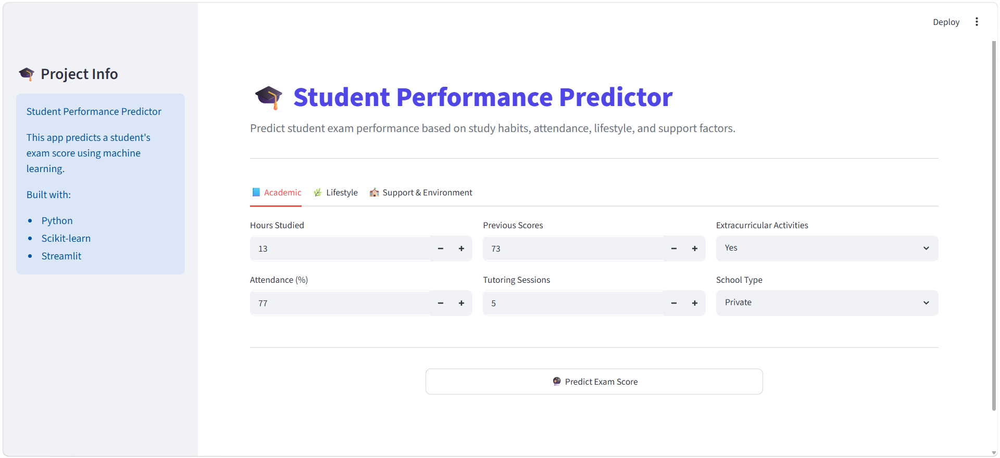
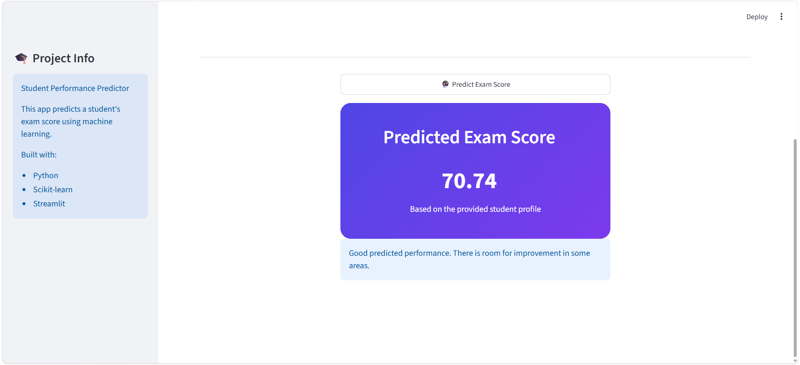

# 🎓 Student Performance Predictor

## 📌 Project Overview

This project predicts student exam performance using machine learning regression techniques.

The goal is to estimate a student's exam score based on academic, lifestyle, and support-related factors.

---

## 🎯 Problem Statement

Student performance can be influenced by many factors such as attendance, study hours, previous scores, family support, and access to resources.

This project uses machine learning to predict exam scores and identify important factors affecting student performance.

---

## 📊 Model Performance

| Metric | Value |
|---|---:|
| R² Score | 0.7697 |
| MAE | 0.4516 |
| MSE | 3.2553 |

---

## 🚀 Features

- Data cleaning
- Missing value handling
- Feature encoding
- Correlation analysis
- Regression modeling
- Interactive Streamlit interface

---

## 🛠️ Technologies Used

- Python
- Pandas
- NumPy
- Scikit-Learn
- Streamlit
- Matplotlib
- Seaborn

---

## 📷 Application Preview

---

## 📁 Project Structure

student-performance-predictor/

├── app.py

├── requirements.txt

├── student_performance.ipynb

├── README.md

├── home.png

└── prediction.png

---

## 💡 Future Improvements

- Deploy the application online
- Add more visualization dashboards
- Compare additional regression models
- Improve UI design
